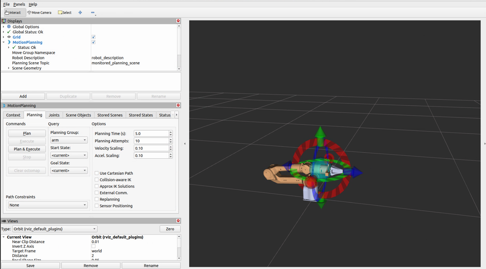

# Piper_Moveit  

[中文](README.md)  

  

| ROS  | STATE |
|------|-------|
|  |  |

## 1 Install MoveIt Environment  

> **Note:** MoveIt 1.1.11 is already included in `src`, no need to download separately.  

The source installation requires `wstool` and `catkin_tools`:  

```bash
sudo apt install python3-wstool python3-catkin-tools python3-rosdep
```

## 2 Install Piper_ros  

Install dependencies:  

```bash
pip install numpy rospkg pyyaml
pip3 install python-can
pip3 install piper_sdk
```

Clone the repository and open a terminal:  

```bash
git clone https://github.com/agilexrobotics/Piper_ros.git -b ros-noetic-no-aloha
```

Enter the workspace:  

```bash
cd Piper_ros
```

Build the workspace:  

```bash
catkin_make
```

## 3 Build the Workspace  

> **Note:** Compilation may fail due to conflicts between the Conda environment and the system environment. You can resolve this by uninstalling Conda or using the system environment. More details: [CSDN Blog](https://blog.csdn.net/endurance2017/article/details/102997980).  

Clone the repository and open a terminal:  

```bash
git clone https://github.com/agilexrobotics/Piper_ros_moveit.git -b ros-noetic-moveit
```

Enter the workspace:  

```bash
cd ~/Piper_ros_moveit
```

Build the workspace:  

```bash
catkin_make
```

## 4 Usage  

### 4.1 Start Piper_ros to Launch the Robot Control Node  

> **Note:** After restarting `moveit/demo.launch`, the ROS control node must be restarted as well. It can be started after launching MoveIt.  

Enter the workspace:  

```bash
cd Piper_ros
source devel/setup.bash
```

Run the control node:  

```bash
roslaunch piper start_single_piper.launch
```

> The system is successfully enabled when confirmation appears.  

### 4.2 Run MoveIt  

Enter the workspace:  

```bash
cd ~/Piper_ros_moveit
source devel/setup.bash
```

### 4.2.1 Run with Gripper  

```bash
roslaunch piper_with_gripper_moveit demo.launch
```

> The gripper mode consists of two control groups:  
> - **Arm Control Group** (joints `joint1` to `joint6`)  
> - **Gripper Control Group** (joints `joint7` and `joint8`). `joint7` is actively controlled, while `joint8` is passively controlled.  

> **Gripper Control Range:**  Control range: `0` to `0.035` (meters).  Actual gripper opening distance: `0` to `0.07` meters (multiply by `2`).  

| joint_name |       limit       |
|------------|------------------|
| joint1     | [-2.618, 2.618]  |
| joint2     | [0, 3.14]        |
| joint3     | [-2.697, 0]      |
| joint4     | [-1.832, 1.832]  |
| joint5     | [-1.22, 1.22]    |
| joint6     | [-3.14, 3.14]    |
| joint7     | [0, 0.035]       |
| joint8     | [-0.035, 0]      |

The control information is published to `/joint_states`:  

```bash
rostopic echo /joint_states
```

>- The first 6 values correspond to the arm's joint positions.  
>- The 7th value corresponds to the gripper position control.  
>- The 8th value is `0` and is not actively controlled.  

### 4.2.2 Run without Gripper  

```bash
roslaunch piper_no_gripper_moveit demo.launch
```

## 4.3 Plan and Execute Motion  

### 4.3.1 Interactive Drag Teaching  

  

After adjusting the position, click **Plan & Execute** in the **MotionPlanning** panel to start planning and executing motion.  

### 4.3.2 Service Control (Joint Angle Control)  

To control the robotic arm (run in terminal):  

```bash
cd Piper_ros_moveit
source devel/setup.bash
```

```bash
rosservice call /joint_moveit_ctrl_arm "joint_states: [0.2,0.2,-0.2,0.3,-0.2,0.5]
max_velocity: 0.5
max_acceleration: 0.5"
```

To control the gripper (run in terminal):  

```bash
rosservice call /joint_moveit_ctrl_gripper "gripper: 0.035
max_velocity: 0.5
max_acceleration: 0.5"
```

Client-side control (run in terminal):  

```bash
rosrun moveit_demo joint_moveit_ctrl.py
```

> Modify [`joint_moveit_ctrl`](src/moveit_demo/scripts/joint_moveit_ctrl.py) to set `arm_position` and `gripper_position` values. Joint angles are in radians.  

### 4.3.3 MoveIt API Control (Joint Angle Control)  

> This can be added to [`joint_moveit_ctrl`](src/moveit_demo/scripts/joint_moveit_ctrl.py) for use.  

```python
#!/usr/bin/env python3

import rospy
import moveit_commander

def move_robot():
    # Initialize MoveIt! components
    moveit_commander.roscpp_initialize([])
    move_group = moveit_commander.MoveGroupCommander("gripper")  # Change to "arm" or "gripper" as needed

    # Get current joint values
    joint_goal = move_group.get_current_joint_values()
    joint_goal[0] = 0.0  # The arm uses a list of 6 values, while the gripper uses a single value
    # joint_goal[1] = 0.0
    # joint_goal[2] = 0.0
    # joint_goal[3] = 0.0
    # joint_goal[4] = 0.0
    # joint_goal[5] = 0.0

    # Set and execute the target position
    move_group.set_joint_value_target(joint_goal)
    success = move_group.go(wait=True)
    rospy.loginfo(f"Movement success: {success}")
    rospy.loginfo(f"Joint values: {move_group.get_current_joint_values()}")

    moveit_commander.roscpp_shutdown()

if __name__ == "__main__":
    try:
        move_robot()
    except rospy.ROSInterruptException:
        pass
```