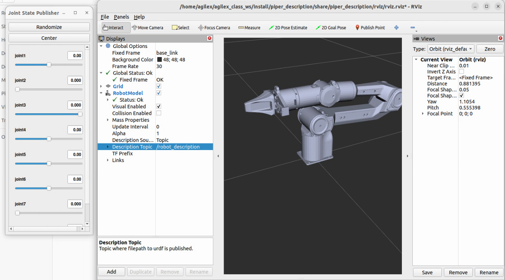
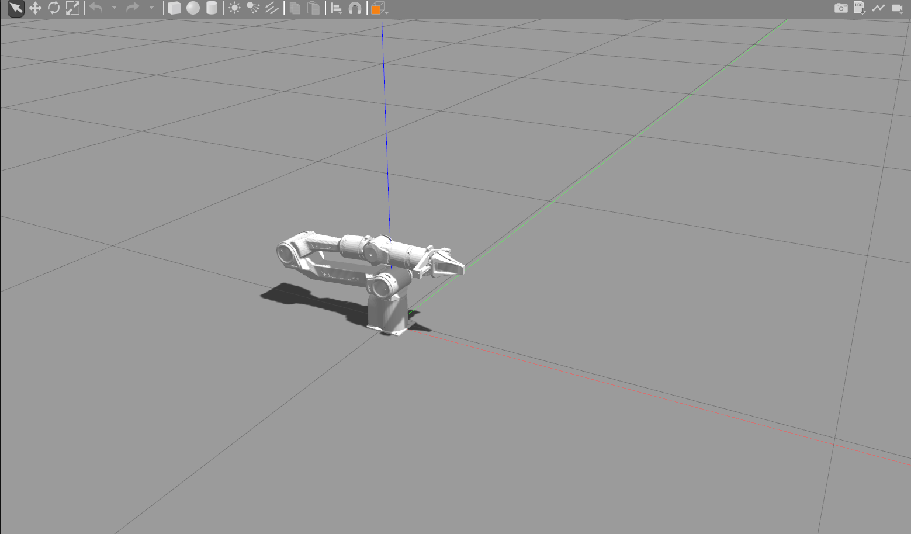
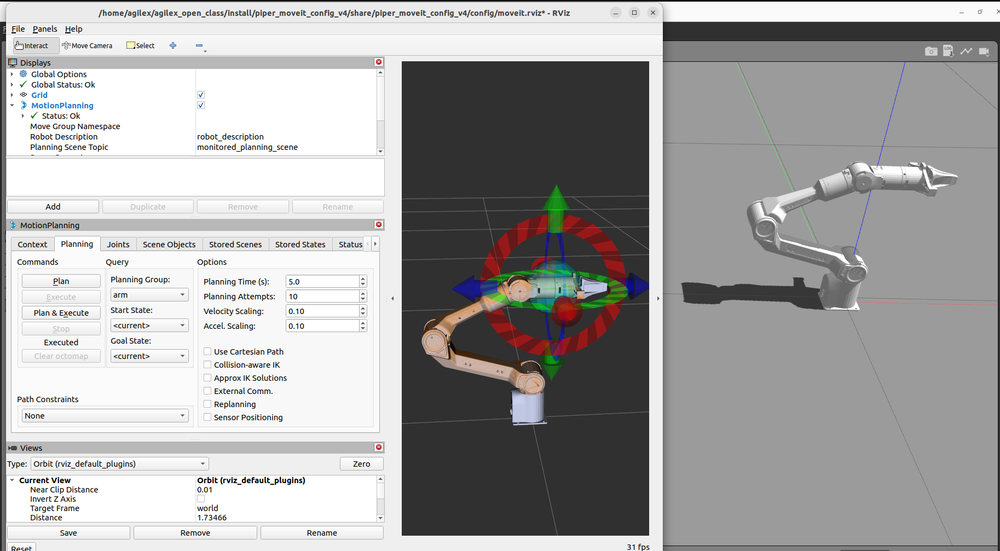

# Piper_Moveit2

> 注：安装使用过程中出现问题可查看第5部分

## 1、安装Moveit2 

1）二进制安装，[参考链接](https://moveit.ai/install-moveit2/binary/)

```
sudo apt install ros-humble-moveit*
```

2）源码编译方法，[参考链接](https://moveit.ai/install-moveit2/source/)

## 2、使用环境

安装完Moveit2之后，需要安装一些依赖

```
sudo apt-get install ros-humble-control* ros-humble-joint-trajectory-controller ros-humble-joint-state-* ros-humble-gripper-controllers ros-humble-trajectory-msgs
```
若系统语言区域设置不为英文区域，须设置

```
echo "export LC_NUMERIC=en_US.UTF-8" >> ~/.bashrc
source ~/.bashrc
```
## 3、工作空间编译
git源码，打开终端
```
git clone https://github.com/agilexrobotics/Piper_ros_moveit.git
```

进入工作空间

```
cd Piper_ros_moveit
```
编译
```
colcon build
```
## 4、使用方法
> 注：在新终端运行launch是都需source一次

进入工作空间
```
cd ~/Piper_ros_moveit
```
source
```
source install/setup.bash
```
### 4.1、moveit rviz仿真
1）查看piper机械臂模型

```
ros2 launch piper_description display_piper.launch.py 
```

成功打开之后，需要在Rviz中添加模型，若显示窗口已有机械臂则无需再添加

在左下角display的add中添加RobotModel，并将Description Topic设置为/robot_description

如下图左侧设置



可以直接通过弹出的控制窗口控制机械臂关节


2）使用moveit2，控制机械臂

(可以独立上一部单独使用，运行后直接添加模型即可，若显示窗口已有机械臂则无需再添加)

```
ros2 launch piper_moveit_config demo.launch.py
```


可以直接拖动机械臂末端的箭头控制机械臂

调整好位置后点击左侧MotionPlanning中Planning的Plan&Execute或Plan即可开始规划

### 4.2、启动Gazebo仿真
> 注：需要关闭4.1中打开的进程后使用，不能同时开启

1）启动Gazebo仿真

```
ros2 launch piper_description piper_gazebo.launch.py
```
按照4.1操作添加模型，若显示窗口已有机械臂则无需再添加



2）使用moveit2，控制机械臂

> 注：有时候会出现moveit控制不了gazebo模型的情况，需要重新启动

```
ros2 launch piper_moveit_config demo.launch.py
```



调整好位置后点击左侧MotionPlanning中Planning的Plan&Execute即可开始规划

这时可以看到gazebo中的模型已经开始移动

## 5、可能遇见的问题

### 5.1、编译报错

    根据报错安装对应缺少的包即可，如果使用的是conda注意环境路径问题

### 5.2、打开gazebo时报错，提示urdf未加载，导致仿真环境中机械臂末端与底座穿模
    1、注意编译后的install下piper_description中是否有config，且config中是否包含src/piper/piper_description中config的文件
    install中缺少urdf同理

    2、注意src/piper/piper_description/urdf/piper_description_gazebo.xacro中644行的路径是否正确，如确认后问题依然存在，将路径改为绝对路径

### 5.3、运行demo.launch.py时报错

    报错：参数需要一个double，而提供的是一个string
    解决办法：
    终端运行
```
echo "export LC_NUMERIC=en_US.UTF-8" >> ~/.bashrc
source ~/.bashrc
```
    或在运行launch前加上LC_NUMERIC=en_US.UTF-8
    例如
```
LC_NUMERIC=en_US.UTF-8 ros2 launch piper_moveit_config demo.launch.py
```